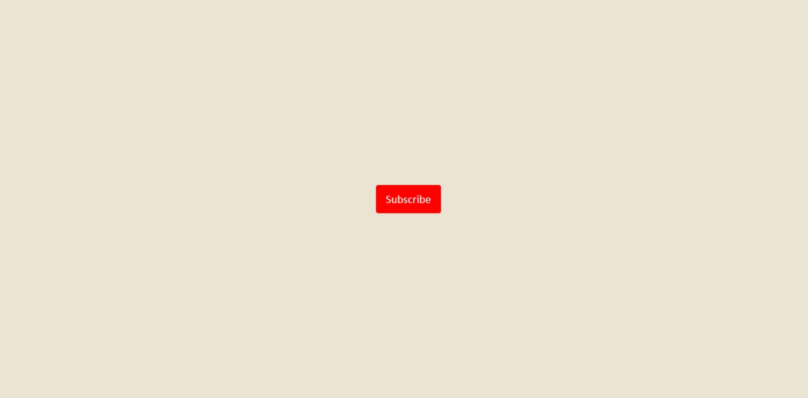
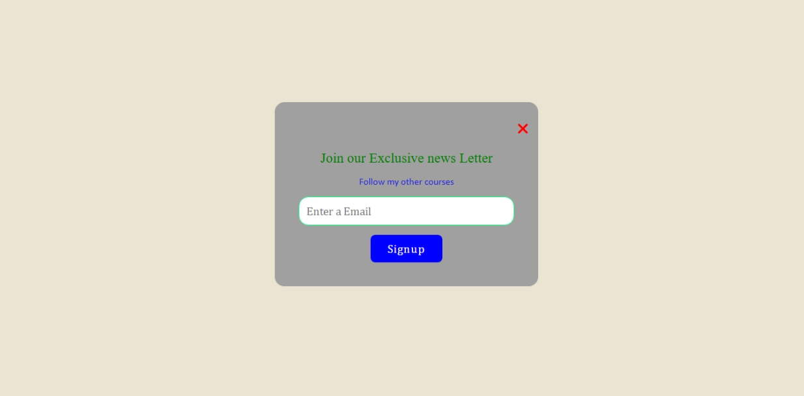

# Popup Newsletter

This is a simple popup newsletter subscription form created using HTML, CSS, and JavaScript. When the "Subscribe" button is clicked, a centered modal appears, allowing users to enter their email and sign up.

## 🚀 Live Demo

[Click here to view the live project](https://msdhinesh45.github.io/Awesome-popup/)

## 📸 Output Screenshots

### ✅ Initial View

### ✅ Popup Activated

## 💡 Features

- Clean UI with modern design
- Responsive popup modal
- Toggle functionality with JavaScript
- Smooth transition and hover effects
- Font Awesome icons for a close button

## 🛠️ Tech Stack

- HTML5
- CSS3
- JavaScript
- Font Awesome

## ✨ How It Works

- The `Subscribe` button triggers a JavaScript function.
- This function toggles the `active` class on the popup.
- The `active` class makes the popup visible by changing its position and opacity.

## 🙋‍♂️ Author

- **Dhinesh Kumar Murugesan** – [https://github.com/msdhinesh45/]

## 📜 License

This project is open-source and free to use.

---

